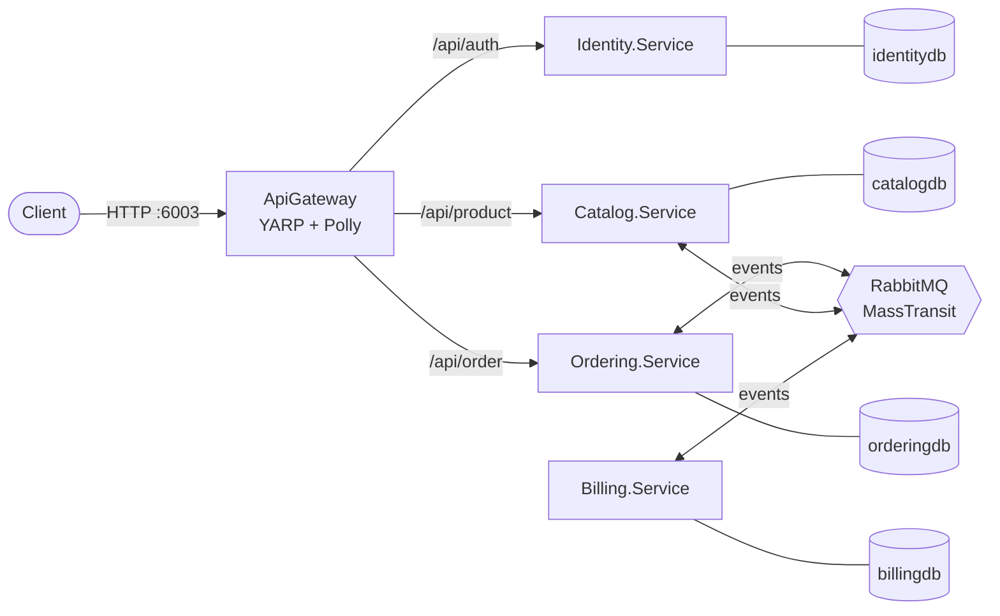
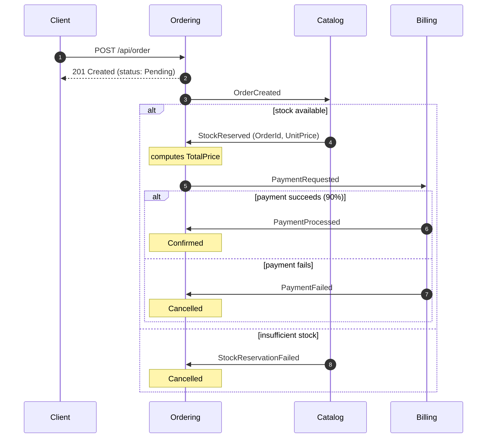

# OrderFlow

[](https://github.com/marcod08/OrderFlow/actions/workflows/ci.yml)

An order-management backend built as a set of **.NET 9 microservices**, created as a portfolio project to show real-world microservice patterns in practice: an event-driven choreographed saga, database-per-service, CQRS with vertical slices, distributed JWT validation with RSA keys, and resilience at the gateway.

The goal is not feature breadth. It is to make every architectural choice deliberate and explained. The [design decisions](#design-decisions) section covers the *why* behind the non-obvious ones.

---

## Architecture



| Service | Responsibility |
|---|---|
| **ApiGateway** | Single entry point exposed to the outside (YARP reverse proxy). Applies timeout, retry and circuit breaker policies to downstream calls. |
| **Identity.Service** | User registration and login via ASP.NET Core Identity. Issues RS256-signed JWTs. Seeds the `Customer`/`Admin` roles and a default admin user in Development. |
| **Catalog.Service** | Products and stock: CRUD plus stock reservation and release. Reacts to `OrderCreated` by trying to reserve stock. |
| **Ordering.Service** | Orders, and the starting point of the saga. Tracks each order's state as events come back. |
| **Billing.Service** | Simulated payment processing (90% random success rate). It has no HTTP API and only talks through events. |
| **BuildingBlocks.\*** | Shared code: MediatR pipeline behaviors (`Application`), exception handling middleware (`Api`), integration event contracts (`Contracts`). |

Each domain service owns a **dedicated PostgreSQL database**. No service reads another service's data, and domain services never call each other over HTTP. All cross-service communication goes through RabbitMQ.

## The order saga

Order processing is a **choreographed saga**. There is no central orchestrator: each service reacts to an event, does its local work, and publishes the next event.



Order lifecycle: `Pending → StockReserved → PaymentProcessed → Confirmed`, or `Cancelled` on any failure.

The client receives `201 Created` right away. The final outcome is visible by polling `GET /api/order/{id}`. This eventual consistency is intentional (see [below](#ordertotalprice-is-nullable-on-purpose)).

## Tech stack

| Area | Technology |
|---|---|
| Runtime | .NET 9, ASP.NET Core Web API |
| Persistence | EF Core 9 + Npgsql, PostgreSQL 16 |
| CQRS / mediator | MediatR 12.4.1 |
| Validation | FluentValidation |
| Messaging | MassTransit 8.5.9 over RabbitMQ |
| Gateway | YARP 2.3 |
| Resilience | Polly (via `Microsoft.Extensions.Http.Resilience`) |
| Auth | ASP.NET Core Identity, JwtBearer, RS256 JWTs |
| Logging | Serilog (structured) |
| Testing | xUnit, FluentAssertions 7, Testcontainers (PostgreSQL) |
| Containers / CI | Docker Compose, GitHub Actions |

Package versions are managed centrally in [`Directory.Packages.props`](Directory.Packages.props) (Central Package Management).

> **Licensing note:** MediatR, MassTransit and FluentAssertions are deliberately pinned to their last open-source major versions (MediatR 12.x, MassTransit 8.x, FluentAssertions 7.x). Later majors moved to commercial licenses.

## Design decisions

### CQRS with vertical slices
Each domain service organizes its `Application` layer **by feature, not by technical type**. Examples: `Orders/CreateOrder/{Command, Handler, Validator}.cs` and `Products/UpdateProductStock/...`. The shared `LoggingBehavior` and `ValidationBehavior` MediatR pipeline behaviors live in `BuildingBlocks.Application`.

### No synchronous calls between domain services
Ordering needs a product's price to compute an order total. Instead of calling Catalog over HTTP, which would couple the two services' availability, Catalog includes the unit price in the `StockReserved` event. This decision is why the messaging infrastructure exists at all. The only synchronous HTTP hop in the system is gateway → service.

### Business failures become events, not retries
Consumers that can fail for business reasons, such as Catalog's `OrderCreatedConsumer` running into insufficient stock, catch the exception and publish a failure event (`StockReservationFailed`). They do not let MassTransit retry the message, because retrying will not create stock. Terminal consumers (for example `PaymentProcessedConsumer`) only update local state and publish nothing further.

### `Order.TotalPrice` is nullable on purpose
When an order is created, its price is not yet known. It only arrives with `StockReserved`. `TotalPrice` is therefore a `decimal?`: the entity is created incomplete and filled in later in the saga. This is eventual consistency applied deliberately, not a bug.

### A dedicated Identity service with RS256
Identity.Service is the only service that holds the **private key** and can sign tokens. Every other service holds only the **public key**, so it can validate tokens but never forge them. With HS256, every service would share one symmetric secret, and a single compromised service could mint valid tokens for the whole system.

Tokens are validated **in each domain service** (issuer, audience, lifetime, signature), not just at the gateway. This is defense in depth.

Identity.Service uses a simpler two-project layout (Api + Infrastructure) because it has no rich business domain. Most of its logic is delegated to ASP.NET Core Identity.

### 404 instead of 403 for other users' orders
`GET /api/order/{id}` and `POST /api/order/{id}/cancel` return the **same 404** whether the order does not exist or belongs to someone else. This way an unauthorized user cannot learn that an order ID is valid.

### Resilience lives at the gateway only
Polly is applied to the gateway's forwarding `HttpClient` through a custom `IForwarderHttpClientFactory` ([`ResilientForwarderHttpClientFactory`](src/ApiGateway/Resilience/ResilientForwarderHttpClientFactory.cs)):

- **Retry** (outermost): up to 3 retries, 500 ms apart, on `503`, connection errors and timeouts.
- **Circuit breaker**: opens at a 50% failure ratio over at least 5 requests and stays open for 10 s.
- **Timeout** (innermost): 2 s **per attempt**, so a hanging attempt is cut short and retried instead of using up the whole budget.

The timeout came from a real bug found in manual testing. A container that was *stopped* but not removed left TCP connections hanging until YARP's default 40 s timeout. Service-to-service messaging does not need Polly, because MassTransit has its own retry mechanism.

### Network exposure
In Docker Compose, **only the gateway publishes a port to the host** (`6003`). The domain services are reachable only inside the Compose network. The Postgres and RabbitMQ ports stay published for local debugging.

## Authorization rules

Roles: `Customer`, assigned on registration, and `Admin`, seeded in Development only.

| Endpoint | Access |
|---|---|
| `POST /api/auth/register`, `POST /api/auth/login` | Public |
| `GET /api/product`, `GET /api/product/{id}` | Public |
| `POST /api/product`, `DELETE /api/product/{id}` | `Admin` |
| `POST /api/product/{id}/reserve-stock`, `POST /api/product/{id}/release-stock` | `Admin` |
| `POST /api/order` | Any authenticated user |
| `GET /api/order/{id}`, `POST /api/order/{id}/cancel` | Authenticated **and** owner of the order (matched against the token's `sub` claim) |

---

## Getting started

### Prerequisites
- [.NET 9 SDK](https://dotnet.microsoft.com/download)
- [Docker](https://www.docker.com/) (for Compose and for the integration tests)
- OpenSSL (to generate the JWT key pair)

### 1. Generate the RSA key pair

```bash
openssl genpkey -algorithm RSA -out jwt-private.pem -pkeyopt rsa_keygen_bits:2048
openssl rsa -in jwt-private.pem -pubout -out jwt-public.pem
```

`*.pem` files are git-ignored. **Never commit them.**

The configuration expects each key on a **single line, with a literal `\n` in place of each newline**. To print a key in that format:

```bash
awk 'NF {printf "%s\\n", $0}' jwt-private.pem
awk 'NF {printf "%s\\n", $0}' jwt-public.pem
```

### 2a. Run everything with Docker Compose

```bash
cp .env.example .env
# edit .env: paste JWT_PRIVATE_KEY, JWT_PUBLIC_KEY and choose ADMIN_SEED_PASSWORD
docker compose up --build
```

The API is then available through the gateway at **http://localhost:6003**. The RabbitMQ management UI is at http://localhost:15672 (`guest` / `guest`).

Databases are migrated automatically at startup in the Development environment.

### 2b. Run the services locally (without containers)

Start only the infrastructure in Docker:

```bash
docker compose up catalogdb orderingdb billingdb identitydb rabbitmq
```

Then create each service's local configuration from its template and fill in the placeholders:

```bash
for dir in src/ApiGateway src/*/*.Service.Api; do
  cp "$dir/appsettings.Development.json.example" "$dir/appsettings.Development.json"
done
```

| Placeholder | Value |
|---|---|
| `<POSTGRES_PASSWORD>` | The Postgres password from `compose.yaml` |
| `<BASE64_PUBLIC_KEY_CONTENT>` / `<BASE64_PRIVATE_KEY_CONTENT>` | Replace the whole value with the single-line key from step 1 |
| `<ADMIN_SEED_PASSWORD>` | Any password with 8+ characters, at least one digit and one symbol |

`appsettings.Development.json` is git-ignored and also excluded from Docker build contexts via `.dockerignore`.

Run each service with `dotnet run --project <path-to-Api.csproj>`.

### Configuration reference

| Key | Used by | Notes |
|---|---|---|
| `ConnectionStrings:{Catalog,Ordering,Billing,Identity}Db` | Each domain service | Local ports: 5432 / 5433 / 5434 / 5435 |
| `RabbitMq:Host`, `RabbitMq:Username`, `RabbitMq:Password` | Catalog, Ordering, Billing | Default to `localhost` / `guest` / `guest` |
| `Jwt:PrivateKey` | Identity | PKCS#8 PEM, single line with `\n` |
| `Jwt:PublicKey` | Catalog, Ordering | SPKI PEM, single line with `\n` |
| `Jwt:Issuer`, `Jwt:Audience` | Identity, Catalog, Ordering | `OrderFlow.Identity` / `OrderFlow.Services` |
| `Jwt:ExpiryMinutes` | Identity | `60` |
| `Seed:AdminPassword` | Identity | Password for `admin@orderflow.com` (Development only) |

> **Why the `\n` replacement in code?** When a PEM key is read from `appsettings.json`, the JSON parser turns `\n` into real newlines. When it arrives through a Docker environment variable, `\n` stays as a literal backslash followed by `n`, and `RSA.ImportFromPem` fails. Each service therefore calls `.Replace("\\n", "\n")` on the key before importing it. The bug only appeared in Docker, which is why the conversion is there.

---

## Trying the API

All requests go through the gateway (`http://localhost:6003`).

```bash
# Log in as the seeded admin
ADMIN_TOKEN=$(curl -s -X POST http://localhost:6003/api/auth/login \
  -H "Content-Type: application/json" \
  -d '{"email":"admin@orderflow.com","password":"<ADMIN_SEED_PASSWORD>"}' | jq -r .token)

# Create a product (Admin only). The response is the new product's id
PRODUCT_ID=$(curl -s -X POST http://localhost:6003/api/product \
  -H "Authorization: Bearer $ADMIN_TOKEN" -H "Content-Type: application/json" \
  -d '{"name":"Mechanical Keyboard","price":89.90,"initialStock":10}' | jq -r .)

# Register and log in as a customer
curl -s -X POST http://localhost:6003/api/auth/register \
  -H "Content-Type: application/json" \
  -d '{"email":"jane@example.com","password":"Customer123!"}'

TOKEN=$(curl -s -X POST http://localhost:6003/api/auth/login \
  -H "Content-Type: application/json" \
  -d '{"email":"jane@example.com","password":"Customer123!"}' | jq -r .token)

# Place an order: returns 201 immediately with the order id
ORDER_ID=$(curl -s -X POST http://localhost:6003/api/order \
  -H "Authorization: Bearer $TOKEN" -H "Content-Type: application/json" \
  -d "{\"productId\":\"$PRODUCT_ID\",\"quantity\":2}" | jq -r .)

# Poll the order: the status moves to Confirmed or Cancelled as the saga completes
curl -s http://localhost:6003/api/order/$ORDER_ID -H "Authorization: Bearer $TOKEN" | jq
```

---

## Tests

```bash
dotnet test OrderFlow.sln
```

- **Unit tests** (`*.UnitTests`) cover the domain entities' invariants and state transitions (`Product`, `Order`, `Payment`).
- **Integration tests** (`*.IntegrationTests`) run the EF Core repositories against a real PostgreSQL instance started by **Testcontainers**. Docker must be running.

The [CI workflow](.github/workflows/ci.yml) restores, builds and tests the whole solution on every push and pull request to `main`, on `ubuntu-latest`.

## Project structure

```
src/
├── ApiGateway/                 YARP gateway + Polly resilience
├── BuildingBlocks/
│   ├── BuildingBlocks.Api/          exception handling middleware
│   ├── BuildingBlocks.Application/  MediatR logging/validation behaviors
│   └── BuildingBlocks.Contracts/    integration events
├── CatalogService/             Api / Application / Domain / Infrastructure
├── OrderingService/            Api / Application / Domain / Infrastructure
├── BillingService/             Api / Application / Domain / Infrastructure
└── IdentityService/            Api / Infrastructure
tests/
└── {Catalog,Ordering,Billing}.Service.{UnitTests,IntegrationTests}
```

Service folders have no dot in their names (`CatalogService`, not `Catalog.Service`) because macOS treats folders with a `.Service`-style extension as application bundles. Project names and namespaces keep the dot.

## Known limitations (by design)

- **No real payment gateway.** Billing simulates the outcome at random, to keep the focus on the event-driven architecture.
- **No refresh tokens or revocation.** JWTs simply expire after 60 minutes.
- **No endpoint to promote a user to Admin.** The admin exists only through startup seeding.
- **No Outbox pattern.** Handlers always save to the database before publishing, but a crash between the two steps could still lose an event. A transactional outbox would close that gap.
